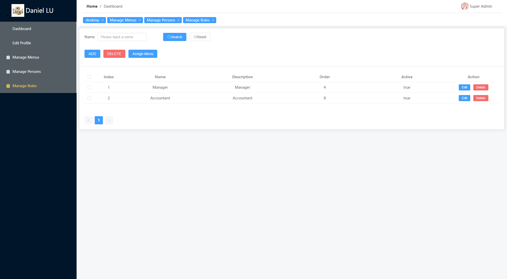

# Admin-Panel-.net-core-webapi-Vue3
An Administration Panel to manage persons, menus, and roles. Using C#, .net core webapi, Vue3, Sql Server, etc.

Screenshots from the system:

Login Page:

Dashboard:

Manage the persons: CRUD

Manage the menus of the system: CRUD

Assign different roles to different persons:

